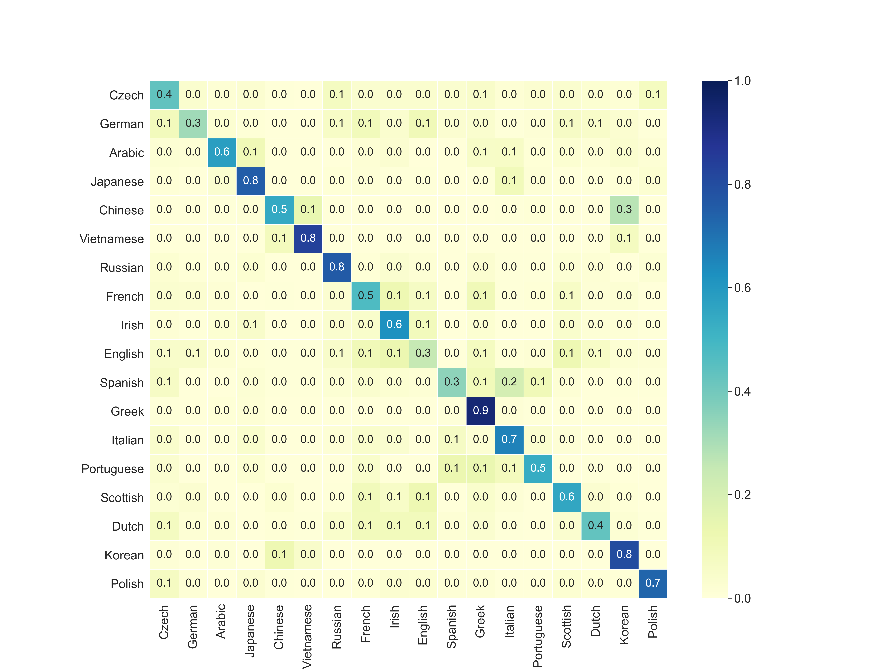
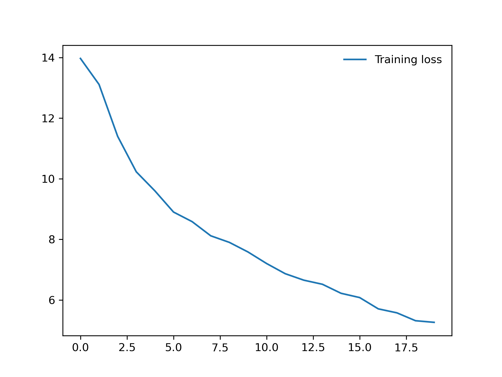
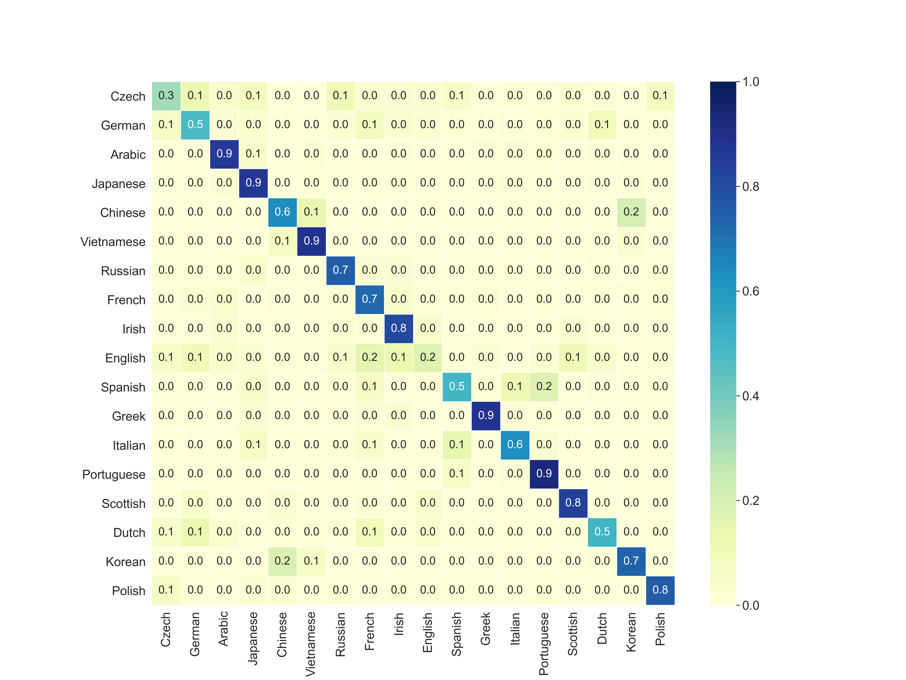
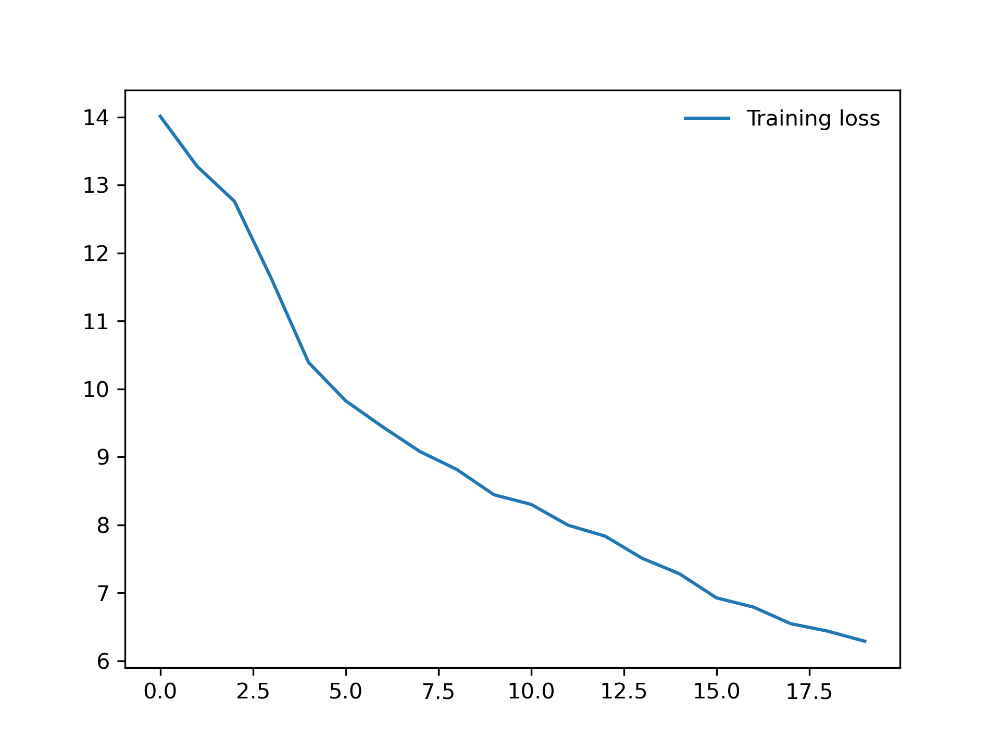
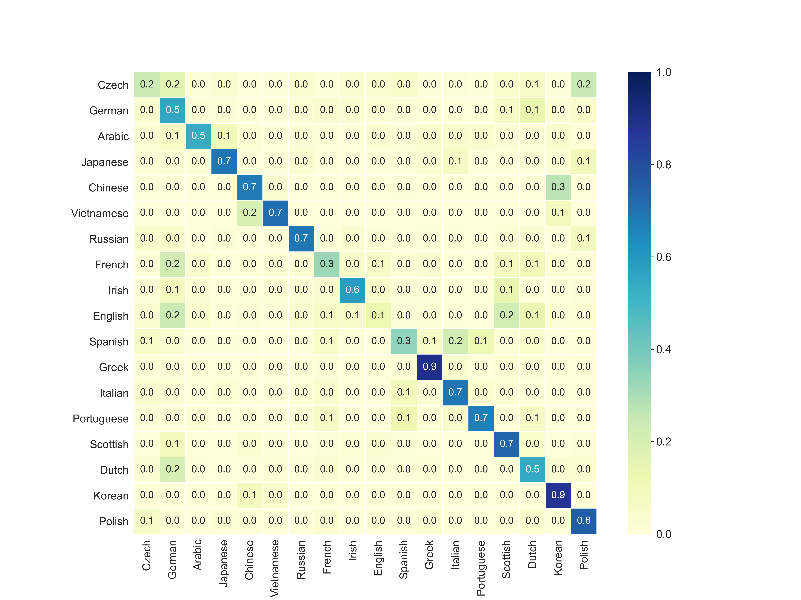
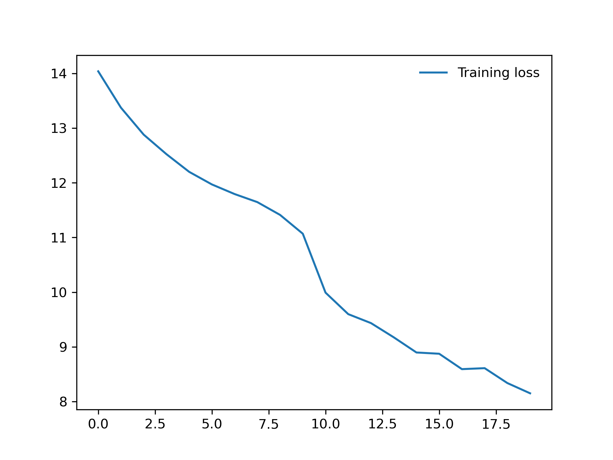
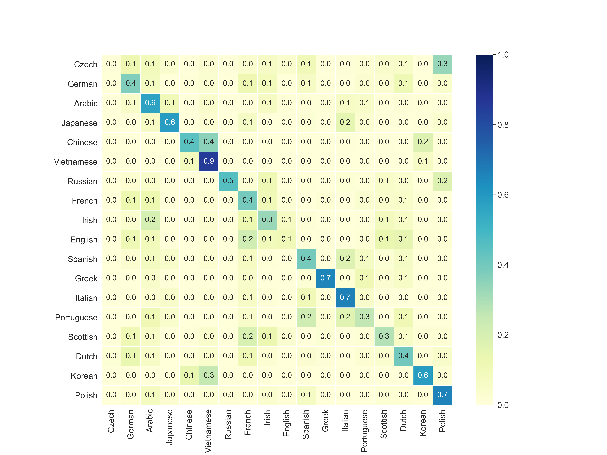
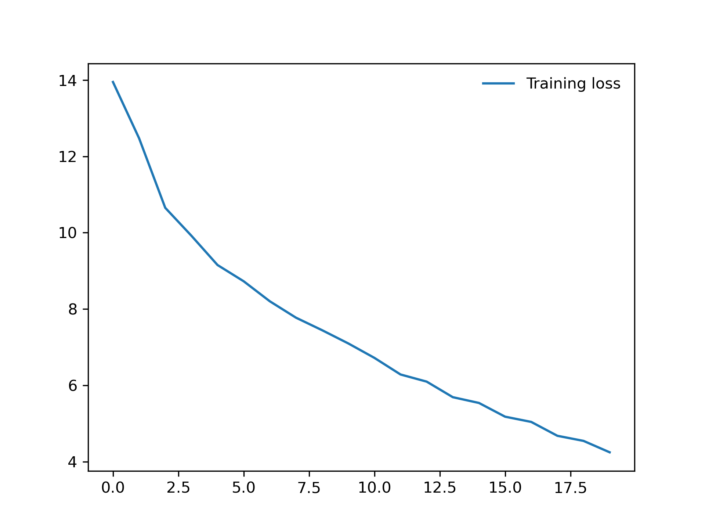
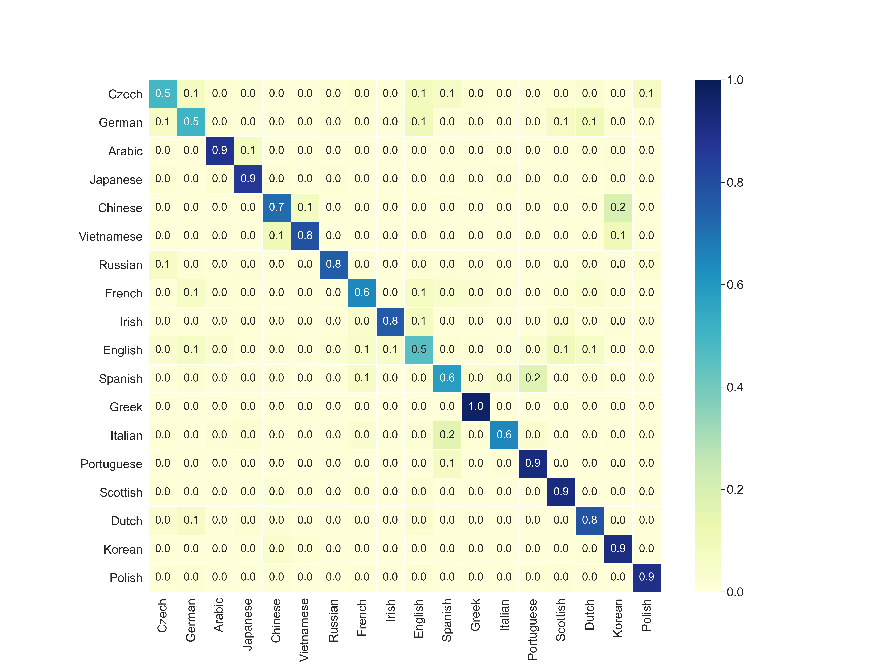

[](https://pytorch.org/)
[](https://www.python.org/)

[](https://scikit-learn.org/stable/)
[](https://www.jetbrains.com/pycharm/)

# Character-Level RNN - (PyTorch Tutorial)

This tutorial is based on the [Sean Robertson](https://pytorch.org/tutorials/intermediate/char_rnn_classification_tutorial) 's
PyTorch tutorial.

The Dataset contains 18 different countries texts; i.e. Czech, German, Arabic, Japanese, Chinese, ....

Each text is consisting of different names; i.e.
- Czech <- Adsit , Alt, Bacon ...
- German <- Abel,  Artz, Auer ...
- ...

Sean used the following structure.

```python
from torch import zeros, cat
from torch.nn import Module, Linear, LogSoftmax

class RNNTutorial(Module):
    def __init__(self, input_size, hidden_size,
                 output_size):
        super(RNNTutorial, self).__init__()
        self.hidden_size = hidden_size
        size_sum = input_size + hidden_size
        self.i2h = Linear(size_sum, hidden_size)
        self.i2o = Linear(size_sum, output_size)
        self.softmax = LogSoftmax(dim=1)

    def forward(self, input_, hidden_):
        combined = cat(tensors=(input_, hidden_), dim=1)
        hidden_ = self.i2h(input=combined)
        output = self.i2o(input=combined)
        output = self.softmax(input=output)
        return output, hidden_

    def init_hidden(self):
        return zeros(1, self.hidden_size)
```

The architecture is trained on 100.000 samples, tested on 10.000 samples.

Accuracy is 58.95%

From below graph, we can say the model is learning.

Here is the confusion matrix:


## Modified Network

Lets see what happens if we change the network structure.

Each changed architecture is trained on 100.000 samples,
tested on 10.000 samples.

* ReLU activation

```python
from torch import zeros, cat
from torch.nn import Module, Linear, LogSoftmax
from torch.nn.functional import relu

class RNNTutorial(Module):
    def __init__(self, input_size, hidden_size,
                 output_size):
        super(RNNTutorial, self).__init__()
        self.hidden_size = hidden_size
        size_sum = input_size + hidden_size
        self.i2h = Linear(size_sum, hidden_size)
        self.i2o = Linear(size_sum, output_size)
        self.softmax = LogSoftmax(dim=1)

    def forward(self, input_, hidden_):
        combined = cat(tensors=(input_, hidden_), dim=1)
        hidden_ = self.i2h(input=combined)
        hidden_ = relu(hidden_)  # ReLU
        output = self.i2o(input=combined)
        output = self.softmax(input=output)
        return output, hidden_

    def init_hidden(self):
        return zeros(1, self.hidden_size)
```

Accuracy is 68.95%

| Train Loss||
|:-:|:-:|
| Confusion Matrix||

* Adding 1 more hidden layer (3-layer)

```python
from torch import zeros, cat
from torch.nn import Module, Linear, LogSoftmax
from torch.nn.functional import relu

class RNNTutorial(Module):
    """`RNN model tutorial`_

    .. _RNN model tutorial:
        https://pytorch.org/tutorials/intermediate/
        char_rnn_classification_tutorial.html
    """
    def __init__(self, input_size, hidden_size,
                 output_size):
        super(RNNTutorial, self).__init__()
        self.hidden_size = hidden_size
        size_sum = input_size + hidden_size
        self.i2h = Linear(size_sum, hidden_size)
        self.h2h = Linear(hidden_size, hidden_size)
        self.i2o = Linear(size_sum, output_size)
        self.softmax = LogSoftmax(dim=1)

    def forward(self, input_, hidden_):
        combined = cat(tensors=(input_, hidden_), dim=1)
        hidden_ = self.i2h(input=combined)
        hidden_ = relu(hidden_)
        hidden_ = self.h2h(hidden_)
        hidden_ = relu(hidden_)
        output = self.i2o(input=combined)
        output = self.softmax(input=output)
        return output, hidden_

    def init_hidden(self):
        return zeros(1, self.hidden_size)
```

Accuracy is 59.19%

| Train Loss   ||
--------------:|:-------------|
| Confusion Matrix||

* Adding 3-more hidden layers (5-layer)

```python
from torch import zeros, cat
from torch.nn import Module, Linear, LogSoftmax
from torch.nn.functional import relu

class RNNTutorial(Module):
    def __init__(self, input_size, hidden_size,
                 output_size):
        super(RNNTutorial, self).__init__()
        self.hidden_size = hidden_size
        size_sum = input_size + hidden_size
        self.i2h = Linear(size_sum, hidden_size)
        self.h2h = Linear(hidden_size, hidden_size)
        self.i2o = Linear(size_sum, output_size)
        self.softmax = LogSoftmax(dim=1)

    def forward(self, input_, hidden_):
        combined = cat(tensors=(input_, hidden_), dim=1)
        hidden_ = self.i2h(input=combined)
        hidden_ = relu(hidden_)
        hidden_ = self.h2h(hidden_)
        hidden_ = relu(hidden_)
        hidden_ = self.h2h(hidden_)
        hidden_ = relu(hidden_)
        hidden_ = self.h2h(hidden_)
        hidden_ = relu(hidden_)
        output = self.i2o(input=combined)
        output = self.softmax(input=output)
        return output, hidden_

    def init_hidden(self):
        return zeros(1, self.hidden_size)
```

Accuracy: 44.34%

| Train Loss   ||
|:-:|:-:|
| Confusion Matrix||

## Summary of the relu activation with 128 neuron results:

| Tutorial (2-layer)|2-layer|3-layer|5-layer|
| :-:|:-:|:-:|:-:|
| 58.95%|**68.95%**|59.19%|44.34%|

### Adding more hidden layers is not increasing the accuracy,
### How about increasing neuron size?

|                   | 128 neuron| 256 neuron|512 neuron|
| :----------------:|:---------:|:---------:|:--------:|
| Tutorial (2-layer)| 58.95%    |60.59%     |59.18%    |
|       2-layer     | 68.95%    |70.36%     |**75.47%**|

From above we can see that 68.95% increase to 75.47%

| 2-layer           |128 neuron (68.95%)                                 |512 neuron (75.47%)|
|:----------------:|:--------------------------------------------------:|:--------:|
| Train Loss        |                  ||
| Confuson Matrix   |||

## Can we pass 75.47% accuracy?

### LSTM Model

```python
class LSTMModel(Module):
    def __init__(self, input_size, hidden_size,
                 num_layers, dropout, output_size):
        super(LSTMModel, self).__init__()
        self.token_size = output_size
        self.mul_size = input_size * hidden_size
        self.encoder = Embedding(num_embeddings=output_size,
                                 embedding_dim=input_size)
        self.rnn = getattr(nn, 'LSTM')(input_size,
                                       hidden_size, num_layers)
        self.decoder = Linear(in_features=self.mul_size,
                              out_features=output_size)
        self.init_weights()
        self.hidden_size = hidden_size
        self.weight_size = (1, input_size, hidden_size)

    def init_weights(self):
        init_range = 0.1
        uniform_(self.encoder.weight, -init_range,
                 init_range)
        zeros_(self.decoder.weight)
        uniform_(self.decoder.weight, -init_range,
                 init_range)

    def forward(self, input_, hidden_):
        embedded = self.encoder(input_)
        output, hidden_ = self.rnn(embedded, hidden_)
        out_reshaped = output.reshape((1, self.mul_size))
        decoded = self.decoder(out_reshaped)
        return log_softmax(input=decoded, dim=1), hidden_

    def init_hidden(self):
        weight = next(self.parameters())
        return (weight.new_zeros(self.weight_size),
                weight.new_zeros(self.weight_size))
```

| | 128 neuron| 256 neuron|512 neuron|
| :-:|:-:|:-:|:-:|
| RNN (2-layer)| **68.95%** |**70.36%**|**75.47%**|
| LSTM (1-layer)| 65.68%|65.62%|67.38%|
| LSTM (2-layer)| 61.42%|63.26%|64.07%|

The results show RNN performs better than the LSTM with no-dropout.

## LSTM w/ Dropout

```python
self.rnn = getattr(nn, 'LSTM')(input_size,
                               hidden_size,
                               num_layers,
                               dropout=dropout)
```

The other possible way to improve LSTM accuracy is using `dropout`. We will separately add `dropout` to the inside of the network, encoder, and before the decoder.

| `dropout`: 0.5 |128 neuron|256 neuron|512 neuron|
|:-:|:-:|:-:|:-:|
| RNN (2-layer)|**68.95%**|**70.36%**|**75.47%**|
| LSTM (2-layer)|63.46%|64.91%|66.44%|
| LSTM (3-layer)|14.79%|43.43%|58.13%|

### Will adding `dropout` to the encoder improve the accuracy?

```python
def forward(self, input_, hidden_):
       embedded = self.drop(self.encoder(input_))
       ...
```

| `dropout`: 0.5 |128 neuron|256 neuron|512 neuron|
|:-:|:-:|:-:|:-:|
| RNN (2-layer)|**68.95%**|**70.36%**|**75.47%**|
| LSTM (2-layer)|63.98%|66.46%|65.79%|
| LSTM (3-layer)|36.24%|32.35%|12.02%|

### Will adding `dropout` before decoder improve the accuracy?

```python
def forward(self, input_, hidden_):
       embedded = self.drop(self.encoder(input_))
       output, hidden_ = self.rnn(embedded, hidden_)
       output = self.drop(output)
       ...
```

| `dropout`: 0.5 |128 neuron|256 neuron|512 neuron|
|:-:|:-:|:-:|:-:|
| RNN (2-layer)|**68.95%**|**70.36%**|**75.47%**|
| LSTM (2-layer)|54.87%|56.92%|57.80%%|
| LSTM (3-layer)|12.64%|14.31%|11.02%|

### GRU Model

```python
self.rnn = getattr(nn, 'GRU')(input_size,
                              hidden_size, num_layers)
.
.
def init_hidden(self):
    weight = next(self.parameters())
    if self.rnn_type == 'LSTM':
        return (weight.new_zeros(self.weight_size),
                weight.new_zeros(self.weight_size))
    elif self.rnn_type == 'GRU':
        return weight.new_zeros(self.weight_size)
    else:
        raise Exception('rnn type can be either '
                        'LSTM or GRU, current '
                        'rnn type is {}'.
                        format(self.rnn_type))
```

| | 128 neuron| 256 neuron|512 neuron|
| :-:|:-:|:-:|:-:|
| LSTM (1-layer)| 65.68%|65.62%|67.38%|
| GRU (1-layer)| **68.59%**|**70.71%**|**69.88%**|
| LSTM (2-layer)|61.42%|63.26%|64.07%|
| GRU (2-layer)|**68.96%**|**67.49%**|**69.55%**|

## GRU w/ Dropout

### Will adding `dropout` to the encoder improve the accuracy?

| `dropout`: 0.5 |128 neuron|256 neuron|512 neuron|
|:-:|:-:|:-:|:-:|
| LSTM (2-layer)|63.98%|66.46%|65.79%|
| GRU (2-layer)|**69.38%**|**68.81%**|**67.04%**|
| LSTM (3-layer)|36.24%|32.35%|12.02%|
| GRU (3-layer)|**68.01%**|**66.63%**|**66.62%**|

### Will adding `dropout` before decoder improve the accuracy?

| `dropout`: 0.5 |128 neuron|256 neuron|512 neuron|
|:-:|:-:|:-:|:-:|
| LSTM (2-layer)|54.87%|56.92%|57.80%%|
| GRU (2-layer)|**59.77%**|**61.82%**|**60.10%**|
| LSTM (3-layer)|12.64%|14.31%|11.02%|
| GRU (3-layer)|**60.94%**|**60.53%**|**58.65%**|

So far the best performing parameters:

| no `dropout` |Accuracy|Neuron|Layer|
|:-:|:-:|:-:|:-:|
| **RNN**|**75.47%** | 512 | 2 |
| LSTM |67.38% | 512 | 1 |
| GRU |70.71% | 256 | 1 |

For the small dataset, LSTM and GRU models are not performing well. We have illustrated the accuracy scores with different parameters.

## Contributing :thought_balloon:
Pull requests are welcome.

If you have any suggestions, or ideas or improvements feel free to email or open issue.

For major changes, please open an issue, then discuss what you would like to change.
